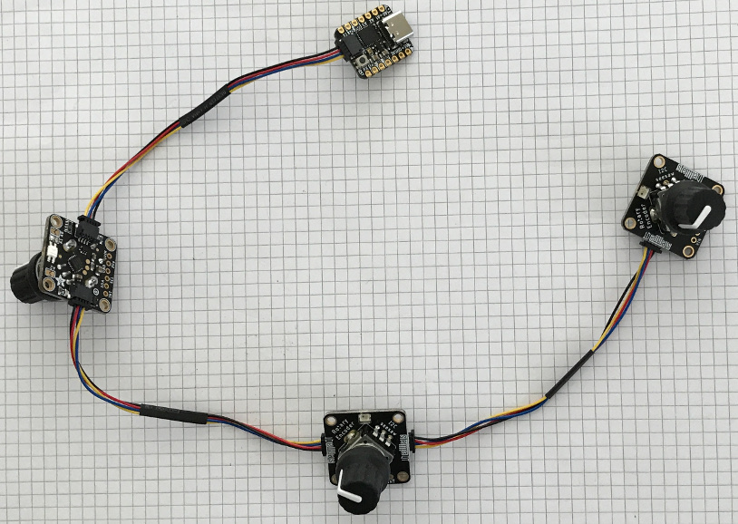
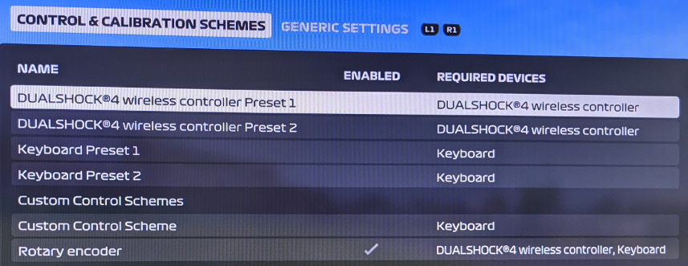
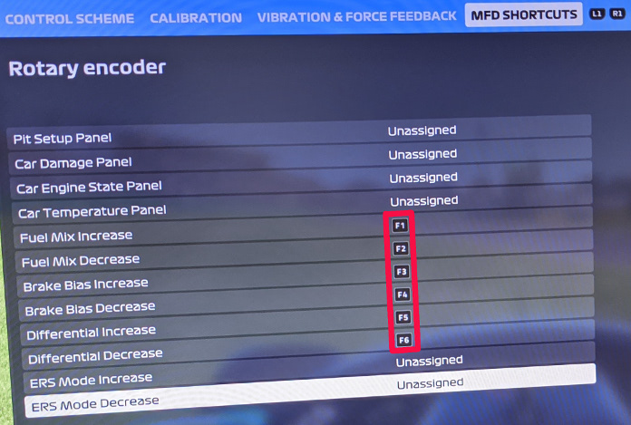

# USB Keyboard Button Box with 11 buttons and 3 rotary encoders.

This is a USB keyboard that works on a PlayStation 4 (PS4). Rotating the first
encoder sends USB key F1 or F2 depending on the direction.

Tested on PS4 with F1 2020 racing game. Note a second keyboard can be
plugged in at the same time. For example, a USB number keypad can be used for
buttons and this project for rotary encoders. The PS4 is happy to accept input
from both USB keyboards.

## Hardware

* [Adafruit QT Py SAMD21 board](https://www.adafruit.com/product/4600)
* [Adafruit Rotary Encoder board](https://www.adafruit.com/product/4991)
* Encoders, knobs, wires

The sketch will auto-detect up to 3 encoders on the first 3 addresses.

Each rotary encoder can be rotated clock wise or counter clock wise.
Each rotary encoder is also a button.
Each rotary encoder board has an RGB LED.
Rotating an encoder clock wise, blinks its LED red.
Rotating an encoder counter clock wise, blinks its LED green.

Rotating an encoder triggers USB keyboard presses. For example, rotating
encoder 0 counter clock wise sends one USB key F1 key per click. Rotating the
encoder in the other direction sends F2. Pressing the encoder down like a
button, presses USB key F7. Releasing the encoder, releases USB key F7.

Rotary Encoder       |USB Key
---------------------|---------------
0 counter clock wise |F1
0 clock wise         |F2
0 button             |F7
1 counter clock wise |F3
1 clock wise         |F4
1 button             |F8
2 counter clock wise |F5
2 clock wise         |F6
2 button             |F9

## F1 2020 Racing Game Configuration

Create a custom scheme.

For example, configure the racing simulation game "F1 2020" with the following
key bindings.

Key |F1 2020 feature
----|----------------------------------
F1  |Fuel mix down
F2  |Fuel mix up
F3  |Front brake bias down
F4  |Front brake bias up
F5  |Differential down
F6  |Differential up
F7  |Next camera (Change Point-of-View)
F8  |
F9  |

